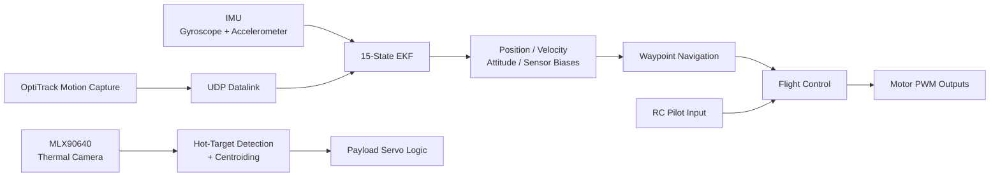

# Autonomous Quadcopter Flight Stack

Autonomous flight software for a custom quadcopter built around a Raspberry Pi and Navio2 flight controller. The project integrates **state estimation, waypoint navigation, closed-loop flight control, thermal sensing, and payload actuation** in a real-time C++ system.

The primary goal was to build the autonomy stack at a low level rather than rely on an existing autopilot. The software directly processes IMU and external localization measurements, estimates the vehicle state, generates waypoint-following commands, and interfaces with the motors and onboard sensors.

## System Overview



## Key Features

### State Estimation

Implemented a **15-state Extended Kalman Filter (EKF)** to estimate:

* 3D position
* 3D velocity
* Roll, pitch, and yaw
* 3-axis gyroscope bias
* 3-axis accelerometer bias

The prediction model propagates the state using onboard gyroscope and accelerometer measurements while accounting for gravity, vehicle orientation, and sensor bias.

External OptiTrack motion-capture measurements provide position and attitude corrections. The estimator also includes:

* Process and measurement noise models
* Covariance propagation and conditioning
* Gyroscope and accelerometer bias estimation
* Quaternion-to-Euler conversion
* Angle normalization and numerical safeguards
* Handling for variable integration intervals

The flight loop processes IMU-based estimation updates at approximately **400 Hz**, with motion-capture measurements read at approximately **250 Hz**.

### Autonomous Waypoint Navigation

Built a waypoint-following system that operates directly from the estimated vehicle state.

The controller:

1. Initializes a mission relative to the vehicle's estimated starting position.
2. Computes 3D position error to the active waypoint.
3. Uses PID feedback to generate desired lateral attitude and vertical thrust commands.
4. Limits commanded attitude for safe flight.
5. Determines waypoint arrival using a configurable acceptance radius.
6. Holds position before automatically advancing to the next waypoint.

Autonomous control can be enabled or disabled through the RC transmitter, allowing manual control to remain available during testing.

### Flight Control

The software interfaces directly with the Navio flight-control hardware for:

* IMU acquisition
* RC receiver input
* Motor PWM output
* ADC measurements
* Barometric sensing
* Servo output

The control stack includes PID feedback, integral windup limits, command saturation, motor arming logic, and explicit manual/autonomous mode switching.

### Thermal Target Detection

The project also integrates an **MLX90640 32 × 24 infrared thermal camera**.

Thermal-processing code includes:

* Raw frame acquisition over I²C
* Sensor calibration and bad-pixel correction
* Temperature-map generation
* Hot-region thresholding
* Connected segment detection
* Target centroid calculation
* Target offset relative to the camera center

This provides the foundation for using onboard thermal perception to identify and localize a target during flight.

### Payload System

Servo-control logic was developed for a payload mechanism that can respond to either RC commands or thermal target detections.

The repository contains the target-based payload triggering logic used during integration testing. The automatic trigger path is currently disabled in the main flight loop while the individual subsystems are tested independently.

## Software Architecture

The project is primarily implemented in **C++17** and runs onboard Linux-based embedded hardware.

| Component          | Implementation                                 |
| ------------------ | ---------------------------------------------- |
| State estimation   | Custom 15-state Extended Kalman Filter         |
| Navigation         | 3D waypoint follower                           |
| Control            | PID-based position and attitude control        |
| Localization       | OptiTrack motion capture over network datalink |
| Inertial sensing   | MPU9250 / Navio2                               |
| Thermal perception | MLX90640 infrared array                        |
| Flight computer    | Raspberry Pi + Navio2                          |
| Motor interface    | 400 Hz PWM                                     |
| Payload            | PWM servo                                      |
| Build system       | CMake                                          |

## Repository Structure

```text
autonomy-capstone/
├── sas.cpp
│   ├── State estimation
│   ├── Flight-control loop
│   ├── Waypoint navigation
│   ├── RC/autopilot switching
│   ├── Thermal target detection
│   └── Payload control
│
├── mlx90640_sender.cpp
│   └── Standalone thermal-camera development/testing
│
├── MLX90640_API.cpp/.h
│   └── MLX90640 sensor API
│
├── MLX90640_I2C_Driver.cpp/.h
│   └── Thermal-camera I²C interface
│
├── MLX90640_LINUX_I2C_Driver.cpp
│   └── Linux implementation of the sensor interface
│
└── CMakeLists.txt
    └── C++ build configuration
```

## Building

This project was developed for the Raspberry Pi/Navio hardware environment and assumes the required Navio and project datalink libraries are available at the paths referenced by `CMakeLists.txt`.

```bash
git clone https://github.com/Adwait-H/autonomy-capstone.git
cd autonomy-capstone

mkdir build
cd build

cmake ..
make
```

The primary flight executable generated by the build system is:

```text
navio2sas
```

Additional Linux dependencies include `pigpio`, `pthread`, `rt`, and `atomic`.

## Engineering Focus

The main challenge of this project was integrating algorithms that are often developed independently into a single real-time system:

* Converting raw inertial measurements into a usable vehicle-state estimate
* Reconciling coordinate frames between sensors, motion capture, and control
* Running estimation and control at different update rates
* Maintaining stable manual-to-autonomous mode transitions
* Translating position errors into physically meaningful flight commands
* Integrating perception and payload hardware with flight-critical software
* Debugging algorithms on actual embedded hardware rather than only in simulation

The project provided hands-on experience implementing the full **sensing → estimation → guidance → control → actuation** pipeline for an autonomous aerospace system.
